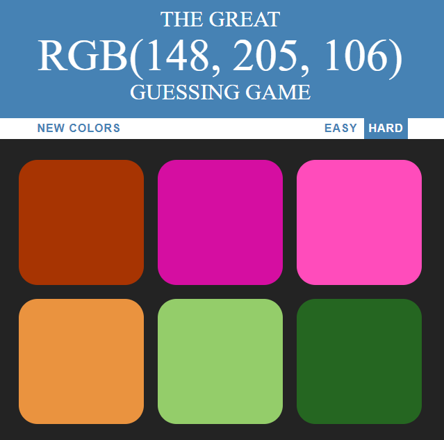
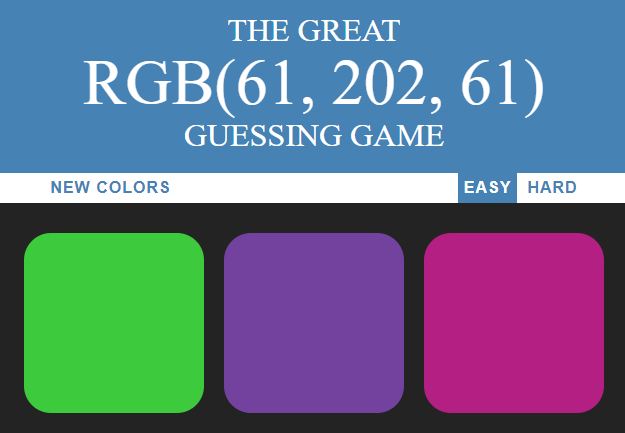
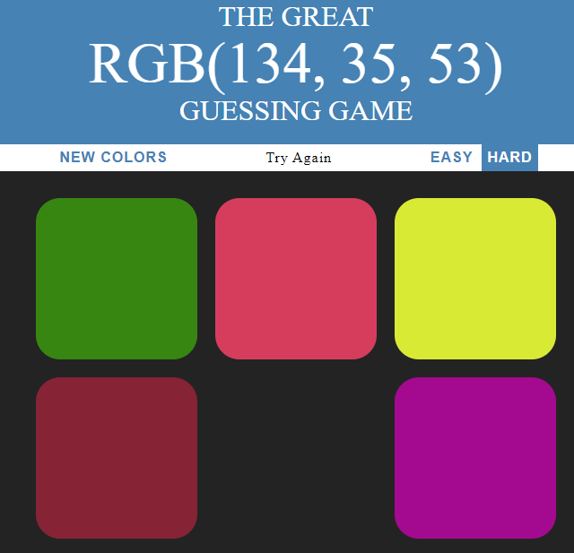
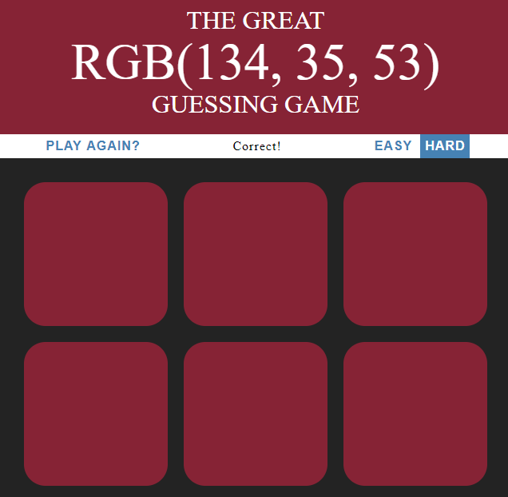

# Color-Guessing-Game
A fun game to identify the correct color using the rgb color code.

## Levels
* You can choose either **EASY** level which has 3 colours or **HARD** level which has 6 colours.
* Click on **NEW COLORS** to get a new set of colors. 

## Selecting answer color
- If you select the wrong color box, the box disappears.
- If you select the right color box, the colors of all the boxes change.

